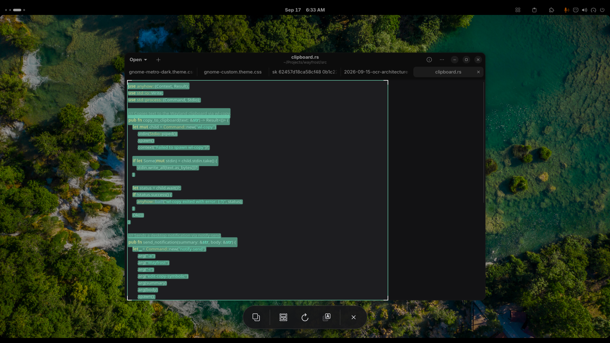

# Wayfrost

Fast and lightweight native Wayland text extraction tool for GNOME and Wayland compositors (similar to Apple Live Text and Windows PowerToys Text Extractor).

[](#english) [](#türkçe)



---

<a name="english"></a>
## English

### Features
- Full Turkish and English character recognition (`ç, ğ, ı, ö, ş, ü` and uppercase variants).
- 2D spatial line clustering ensuring correct reading order without scrambling.
- Built with GTK4 and Libadwaita.
- Tesseract `tessdata_best` and ONNX model support.

### Installation
Clone the repository and run the automated installation script:

```bash
git clone https://github.com/Lowell137/wayfrost.git
cd wayfrost
chmod +x install.sh
./install.sh
```

This script automatically installs required dependencies (GTK4, Libadwaita, Tesseract, Rust) based on your Linux distribution (Arch, Debian/Ubuntu, Fedora), compiles the release binary to `~/.local/bin/wayfrost`, and sets up the `<Super><Shift>t` shortcut.

---

<a name="türkçe"></a>
## Türkçe

### Özellikler
- Türkçe ve İngilizce tam karakter desteği (`ç, ğ, ı, ö, ş, ü` ve büyük harfler).
- 2D uzaysal satır kümeleme ile bozulmayan, doğru okuma sırası.
- GTK4 ve Libadwaita tabanlı şık arayüz.
- Tesseract `tessdata_best` ve ONNX model desteği.

### Kurulum
Depoyu klonlayın ve otomatik kurulum scriptini çalıştırın:

```bash
git clone https://github.com/Lowell137/wayfrost.git
cd wayfrost
chmod +x install.sh
./install.sh
```

Bu script dağıtınıza göre (Arch, Debian/Ubuntu, Fedora) eksik paketleri otomatik kurar, binary dosyasını `~/.local/bin/wayfrost` altına derler ve `<Super><Shift>t` kısayolunu tanımlar.
